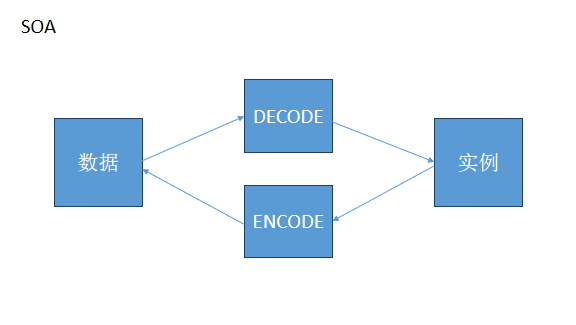

# 关于编解包项目的总结
## 项目主要目标
* 本项目根据定义的文档，完成自定协议的编解包
## 项目介绍
* 本项目为在发生网络故障时快速定位，主要用于在协议层根据设定的规则对数据解包和做包
* 
## 得到经验
* 1.位运算
* 2.io读写
* 3.go test
* 4.debug
* 5.切片性质
* 6.大小端
## 具体经验
### 2.io读写
```
var reader io.Reader
bufreader := bufio.NewReader(reader)
n, err1 := bufreader.Read(result)
if err1 != nil {
println(err1)
}
```

```
var buf bytes.Buffer
buf.Write(result)
reader := &buf

p1, err := Decode(reader)
```
* 问题出在bufio.NewReader(reader)这一行。具体来说，问题在于在这里尝试对一个未初始化的io.Reader进行读取操作，这会导致空指针引用错误。在这里，reader是一个未初始化的接口类型变量，尝试使用bufio.NewReader对其进行初始化是不正确的。
* 而在第二个代码片段中，您首先创建了一个bytes.Buffer类型的变量buf，并使用buf.Write(result)将数据写入到缓冲区中，然后将buf用作io.Reader类型的变量进行解码操作。这是一个正确的做法，因为bytes.Buffer类型实现了io.Reader接口，可以直接用于读取数据
* 

### 5.切片性质
* 当切片由如下初始化时，切片需要一个空间
```
var slice []uint32{1,2,3,4}
```
* 当切片由如下初始化时，初始化需要的空间是3个，因为需要一个位置来存储len和cap，另外还需要一个位置来存储切片中的元素。
```
a := []uint32{1}
```
#### 关于切片panic问题
* 使用var关键字创建的切片会被初始化为nil，因此在添加元素之前必须先分配内存，通常需要使用append函数来添加元素，否则会导致panic。而使用make函数创建的切片，可以在创建时指定初始长度和容量，因此可以直接通过索引赋值的方式来添加元素，而无需使用append函数。这是因为make函数在创建切片时已经分配了指定长度和容量的内存空间，因此可以直接对切片进行赋值操作，而不会导致panic。
## 标准化问题
#### 常量命名
* 应该按常量分组编写前缀，如:SESSION_TYPE_REQUIRED_ACK uint8 = 0x01
#### 结构体命名
* 结构体中的变量应该命名为大写，否则无法访问
#### 错误处理
* err应该都命名为一个，不出现err1,err2等

