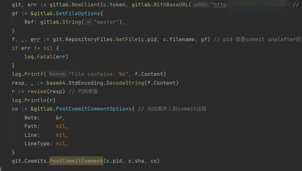
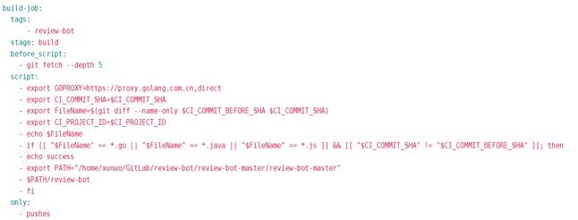
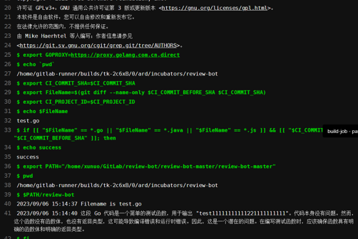
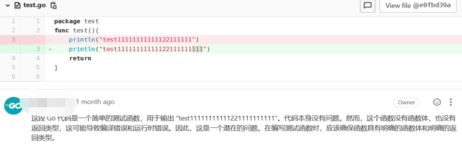

# 关于gitlab-ci的项目总结
## 项目主要目标
* 通过gitlab-ci和部署的大语言模型完成自动代码审查
## 具体步骤
### 使用gitlab api与服务器部署的大语言模型相连
* 下列代码作用共有: 1.gitlab鉴权 2.读取文件 3.review到commit中

### 基于docker在服务器上部署runner
* runner可以看作gitlab对服务器进行访问的一种权限 在服务器注册部署runner后 脚本就可以访问runner所在服务器的内容了
### gitlab-ci.yml文件的编写
* 也就是自动化脚本的编写

### Job日志

### 成果图

